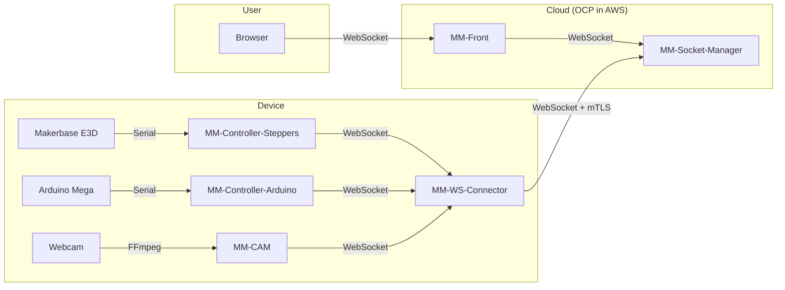
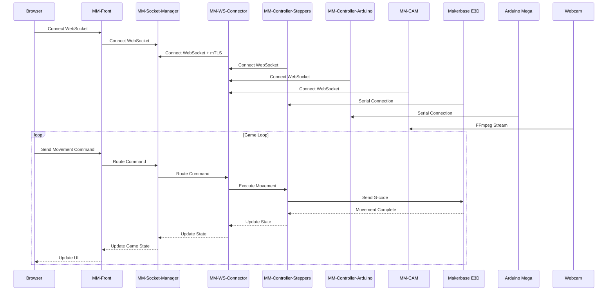
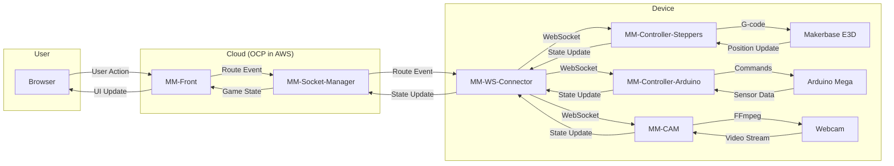
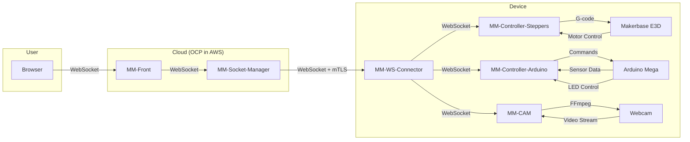

# RCIoTs

> 🚧 **Project and Documentation Under Construction** 🚧

### Introduction

Welcome to RCIoTs, my personal playground where I explore and experiment with Proof of Concepts (POCs) focused on Edge Computing, IoT, robotics, and other fascinating technologies that catch my interest. This space serves as a laboratory for testing and developing innovative solutions that bridge the gap between physical hardware and cloud computing.

The projects in RCIoTs are primarily built using JavaScript, leveraging WebSockets for real-time communication between edge devices, cloud services, and web browsers. I combine this software foundation with 3D printing for hardware prototyping and microcontroller-based electronics that interface with the Edge devices. While these are experimental projects, I ground them in enterprise-grade open source tools from Red Hat to demonstrate how such solutions could scale in production environments using technologies like Red Hat Device Edge, Microshift, FlightCTL, and OpenShift.

### Project Evolution

The RCIoTs ecosystem has evolved through several iterations, with some projects being archived as they served their purpose or were superseded by more advanced implementations:

**RCIoTs PaaS**: This was an early proof of concept for centralized edge application management. While it demonstrated the potential for such a system, I decided to archive it when I began collaborating with FlightCTL, as their solution provided a more robust and production-ready approach to edge management.

**Claw Machine**: A cloud-controlled arcade claw machine that featured real-time video streaming. This project was particularly fun to develop and served as a great learning experience. You can see it in action in this [demonstration video](https://www.youtube.com/watch?v=jNUvxOK2avE).

## Marble Maze

Marble Maze represents the evolution of the Claw Machine project, taking the concept of cloud-controlled physical games to a new level. It's a sophisticated system that combines multiple hardware components and software services to create an engaging multiplayer gaming experience.

### System Architecture

The Marble Maze system is built on a distributed architecture that seamlessly integrates physical hardware with cloud-based services. The architecture is designed to provide real-time, interactive gaming while maintaining reliability and scalability.

#### System Overview

#### Communication Flow

#### Event Flow

#### Hardware Control Flow

The system architecture is built around several key components that work together to create a seamless gaming experience. At the heart of the system is the MM-Socket-Manager, which coordinates all communication between the various components. The MM-WS-Connector serves as the bridge between the hardware controllers (steppers, Arduino, and camera) and the cloud service MM-Socket-Manager. It establishes a secure WebSocket connection with mTLS to the MM-Socket-Manager while maintaining local WebSocket connections with the hardware controllers, routing messages between them.

The hardware layer consists of multiple specialized components:
- A Makerbase E3D controller managing the stepper motors
- An Arduino Mega handling sensor data, servo motors and LED control
- A webcam providing real-time video feed of the game

Each of these components communicates through dedicated controllers that translate high-level commands into specific hardware instructions.

### Core Services

The Marble Maze system is built on a foundation of specialized services, each handling specific aspects of the game's operation. These services are designed to work together seamlessly while maintaining clear separation of concerns.

#### MM-Front
The web-based user interface serves as the primary interaction point for players. The frontend is built with React and served through an Express.js server, which provides a WebSocket endpoint using Socket.IO for real-time communication between user browsers and the MM-Socket-Manager backend service. This architecture enables seamless bidirectional communication while simultaneously handling video streaming integration directly within the web interface.

The interface is designed to be intuitive and responsive, with particular attention to:
- Real-time game state visualization
- Seamless video stream integration
- Intuitive control mechanisms
- Dynamic game state display

#### MM-Socket-Manager
The MM-Socket-Manager serves as the critical interconnection point between the Edge device and the frontend service. It establishes a secure WebSocket connection with mTLS authentication to the Edge device, while simultaneously maintaining the connection with MM-Front. This architecture ensures secure and reliable communication between the physical hardware and the web interface, handling the routing of commands and state updates between both ends of the system.

Key responsibilities include:
- Secure WebSocket connection management with mTLS
- Message routing between Edge device and frontend
- Connection state monitoring and recovery
- Real-time data transmission
- Error handling and logging
- Connection authentication and authorization
- Message validation and sanitization
- Connection pool management

#### MM-WS-Connector
The WebSocket Connector serves as the communication bridge between the hardware controllers (steppers, Arduino, and camera) and the cloud service MM-Socket-Manager. It establishes a secure WebSocket connection with mTLS to the MM-Socket-Manager while maintaining local WebSocket connections with the hardware controllers, routing messages between them.

The connector's architecture is designed to be:
- Reliable: With automatic reconnection and error recovery
- Secure: Using mTLS for cloud communications while maintaining local WebSocket connections
- Efficient: Optimizing message delivery and resource usage
- Scalable: Supporting multiple concurrent connections

#### Hardware Controllers
The system includes specialized controllers for different hardware components:

**MM-Controller-Steppers**: Manages the precise movement of the game's mechanical components through G-code generation and motor control. It sends G-codes to the Marlin firmware deployed on the Makerbase board, maintaining precise position tracking and implementing movement algorithms to ensure smooth and accurate operation.

**MM-Controller-Arduino**: Handles the game's sensor network, servo motors, and LED system, processing sensor data and controlling both servo movements and visual feedback. It implements bidirectional Serial communication between the Node.js controller service and the Arduino's C++ firmware, enabling reliable hardware interaction.

**MM-CAM**: Captures video from the webcam and forwards the streaming via WebSocket to the MM-WS-Connector. The service uses FFmpeg for efficient video processing and implements adaptive quality control to ensure optimal viewing experience.

### Edge Computing Implementation

The Marble Maze project leverages Node.js and Socket.IO as core technologies for its edge computing implementation. This choice was driven by several key factors that make these technologies particularly well-suited for edge computing scenarios.

Node.js provides an ideal foundation for edge computing applications through its event-driven, non-blocking I/O model. This architecture is particularly valuable in edge environments where resources are often constrained and efficient handling of multiple concurrent operations is crucial. The platform's ability to handle numerous simultaneous connections without blocking the main thread makes it perfect for real-time applications like Marble Maze, where we need to manage multiple hardware interfaces, sensor data streams, and user connections simultaneously.

The event-driven nature of Node.js aligns perfectly with the requirements of edge computing. Each component of our system - from motor control to sensor data collection - operates asynchronously, allowing the application to maintain responsiveness even under heavy load. This is particularly important when dealing with hardware interfaces, where timing and responsiveness are critical for precise control of mechanical components.

Socket.IO enhances our edge computing capabilities by providing a robust, bidirectional communication layer. The library's ability to automatically handle connection issues and provide fallback mechanisms is invaluable in edge environments where network conditions can be unpredictable. In Marble Maze, this translates to reliable real-time communication between the game interface, hardware controllers, and all involved services.

One of the most significant advantages of using Socket.IO in our edge implementation is its adaptive protocol system. When WebSocket connections are available, it provides optimal performance with full-duplex communication. However, when network conditions are less than ideal, it gracefully falls back to alternative transport methods, ensuring continuous operation of the system. This reliability is crucial for maintaining the real-time nature of the game while ensuring a smooth user experience.

Node.js and Socket.IO together provide a robust platform for our edge computing needs. The system manages hardware components through serial and USB connections locally, while maintaining WebSocket communications with cloud services. Node.js's event-driven I/O system efficiently handles both local hardware interactions and network communications, enabling precise control of mechanical components alongside real-time user interactions.

In the context of Marble Maze, this technology stack enables several critical features:

Real-time control of the game's mechanical components is achieved through low-latency communication channels. Motor movements, sensor readings, and LED control signals are transmitted with minimal delay, ensuring precise and responsive gameplay. The system maintains a consistent state across all components, synchronizing the physical game state with the digital interface in real-time.

Video streaming is implemented as a one-way flow from the edge device to the cloud, where the frontend service receives the stream and broadcasts it to all connected users. This architecture ensures efficient bandwidth usage at the edge while enabling multiple users to view the game state simultaneously through the frontend's broadcast capabilities.

Session management is implemented with a focus on reliability and user experience. The system handles multiple concurrent players, manages game turns, and maintains synchronized state across all connected clients. When network issues occur, the system implements graceful degradation and recovery mechanisms to ensure a smooth gaming experience.

Monitoring and diagnostics are integral parts of the system. Real-time metrics collection provides insights into system performance, while remote logging capabilities enable quick identification and resolution of issues. The system maintains comprehensive state information about all components, allowing for proactive maintenance and troubleshooting.

The security aspects of our edge computing implementation are particularly important. The system implements robust authentication mechanisms and encrypts communications using TLS/SSL.

This technology stack has proven particularly effective for Marble Maze's requirements, providing the necessary performance, reliability, and flexibility for a complex edge computing application. The combination of Node.js's efficient resource utilization and Socket.IO's robust communication capabilities creates a solid foundation for real-time, interactive and b edge applications.

### Deployment and Infrastructure

The system is deployed across two distinct environments:

#### Cloud Infrastructure
The cloud services (MM-Front and MM-Socket-Manager) run on an OpenShift Container Platform (OCP) cluster deployed on AWS. This provides a robust, scalable platform for the web interface and communication management services, with built-in high availability and security features.

#### Edge Infrastructure
The edge computing components run on an Intel NUC device operating Red Hat Device Edge, a specialized RHEL distribution designed for edge computing scenarios. This distribution includes Microshift, a lightweight version of OpenShift specifically designed for edge environments, which orchestrates the containerized services running on the device.

The device image is built using bootc in image mode, providing an immutable and secure base system. The image and fleet configuration are managed through the marblesmaze-manifests repository, which serves as the central configuration store for the system. This repository defines:

1. **Fleet Configuration**:
   - Fleet (marblesmaze-fleet2) for devices labeled with `fleet: marblesmaze-fleet`
   - OS image specifications from `quay.io/rciots/mm-device-image-rhel`
   - Configuration delivery methods (inline and Git-based)
   - Systemd service monitoring (`microshift.service`, `crio.service`, `flightctl-agent.service`)

2. **MicroShift Components**:
   - mm-cam: Camera interface for video capture
   - mm-controller-arduino: Arduino hardware interface
   - mm-controller-steppers: Stepper motor control
   - mm-ws-connector: WebSocket connectivity to external systems

The edge device is managed through FlightCTL, which provides comprehensive device management capabilities:
- OS updates and configuration
- Application deployment and updates
- Device monitoring and health checks
- Security management and compliance

While the current implementation manages a single edge device, the architecture is designed to scale to hundreds of devices, with FlightCTL providing the necessary fleet management capabilities for such scenarios.

### Edge Management with FlightCTL

The Marble Maze system leverages FlightCTL for comprehensive edge device management, providing a robust platform for OS management, configuration, workload orchestration, and device monitoring. FlightCTL's architecture follows a control plane / data plane pattern, perfectly suited for our edge computing requirements.

#### Control Plane Integration
The system integrates with FlightCTL's control plane components:
- **flightctl-api**: Handles our device's API requests and management operations
- **flightctl-worker**: Processes long-running operations like OS updates
- **flightctl-periodic**: Manages scheduled tasks and system reconciliation

#### Device Management
Our edge device is managed through FlightCTL's comprehensive device management features:

1. **OS Management**:
   - Automated OS updates and rollbacks
   - Image-based deployment
   - System configuration management
   - Security patch management

2. **Configuration Management**:
   - Declarative configuration using GitOps
   - Fleet-based configuration templates
   - Device-specific overrides
   - Configuration versioning and rollback

3. **Workload Management**:
   - Container orchestration with Microshift
   - Application deployment and updates
   - Resource allocation and optimization
   - Service discovery and networking

#### Device Enrollment and Security
The system implements FlightCTL's secure device enrollment process:
1. Device generates cryptographic key pair for identity
2. Enrollment request with CSR is submitted
3. Administrator approval and label assignment
4. Certificate signing and Device resource creation
5. Agent retrieval of signed certificate
6. Management cycle initiation

#### Fleet Management
The system is part of a managed fleet with:

1. **Device Organization**:
   - Device grouping and labeling
   - Fleet-based configuration
   - Rollout policies
   - Device selection rules

2. **Update Management**:
   - Controlled rollout of updates
   - Version management
   - Rollback capabilities
   - Update verification

#### Security Features
FlightCTL provides robust security features:

1. **Device Security**:
   - Certificate-based authentication
   - Secure boot verification
   - Hardware security module integration
   - Secure storage management

2. **Communication Security**:
   - mTLS for all communications
   - Encrypted data transmission
   - Secure API endpoints
   - Access control policies

3. **Compliance Management**:
   - Security policy enforcement
   - Compliance monitoring
   - Audit logging
   - Policy violation detection

#### Integration with Existing Infrastructure
The system integrates with our existing infrastructure through:

1. **Microshift Integration**:
   - Container orchestration
   - Service mesh integration
   - Resource management
   - Network policy enforcement

2. **OS Integration**:
   - OS management
   - System configuration
   - Security updates
   - Hardware management

3. **Monitoring Integration**:
   - Metrics collection
   - Log aggregation
   - Alert management
   - Performance monitoring

### Future Development

The project continues to evolve with several planned enhancements:

1. **Hardware Integration**:
   - Additional sensor types for enhanced game mechanics
   - Improved motor control for more precise movements
   - New mechanical features for expanded gameplay

2. **Software Improvements**:
   - Enhanced multiplayer features
   - Advanced game mechanics
   - Improved user interface
   - Performance optimizations

### Technical Stack

The project utilizes a carefully selected set of technologies that work together to provide a robust and scalable solution:

#### Cloud Infrastructure
- **Platform**: OpenShift Container Platform (OCP) on AWS
- **Services**:
  - MM-Front: React + Express.js for web interface
  - MM-Socket-Manager: Node.js + Socket.IO for WebSocket communication

#### Edge Infrastructure
- **Hardware**: Intel NUC
- **Operating System**: Red Hat Device Edge (RHEL for Edge)
- **Container Orchestration**: MicroShift (Lightweight OpenShift)
- **Device Management**: FlightCTL
- **Image Management**: bootc (image mode)
- **Configuration Management**: marblesmaze-manifests repository

#### Edge Services
- **MM-WS-Connector**: Node.js + Socket.IO with mTLS
- **MM-Controller-Steppers**: Node.js + Serial communication with Marlin firmware
- **MM-Controller-Arduino**: Node.js + Serial communication with Arduino
- **MM-CAM**: Node.js + FFmpeg for video streaming

#### Hardware Components
- **Motion Control**: Makerbase E3D with Marlin firmware
- **Sensors and Actuators**: Managed through Arduino Mega 2560
- **Video Capture**: USB Webcam

#### Communication Protocols
- **Edge-Cloud-Edge**: WebSocket with mTLS
- **Edge-Hardware**: Serial communication
- **Video Streaming**: WebSocket

### Key Features

The Marble Maze system implements several key features that make it unique and engaging:

1. **Real-time Control**: Precise control of physical components through web interface
2. **Multiplayer Support**: Multiple players can interact simultaneously
3. **Video Streaming**: Real-time video feed of the game
4. **Hardware Integration**: Seamless control of multiple hardware components
5. **Scalable Architecture**: Enterprise-grade deployment capabilities
6. **Error Recovery**: Automatic recovery from connection issues
7. **State Management**: Consistent game state across all components

### Development Status

The project is currently under active development, with focus on:
- Enhancing multiplayer capabilities
- Improving hardware control precision
- Optimizing video streaming
- Implementing advanced game features

### Service Integration

The Marble Maze system integrates multiple services through a well-defined communication architecture that ensures reliable operation and real-time responsiveness. The integration is designed to be:

- Reliable: With robust error handling and recovery
- Secure: Using encryption and authentication
- Efficient: Optimizing resource usage
- Scalable: Supporting multiple concurrent users

### Repository Documentation

Each component of the system is documented in detail, with specific information about:
- Purpose and functionality
- Key features and capabilities
- Technical implementation details
- Deployment requirements
- Integration points

You can review the auto-generated documentation for each repository using [DeepWiki](https://deepwiki.com/rciots), which provides comprehensive technical documentation and insights into the codebase structure.

